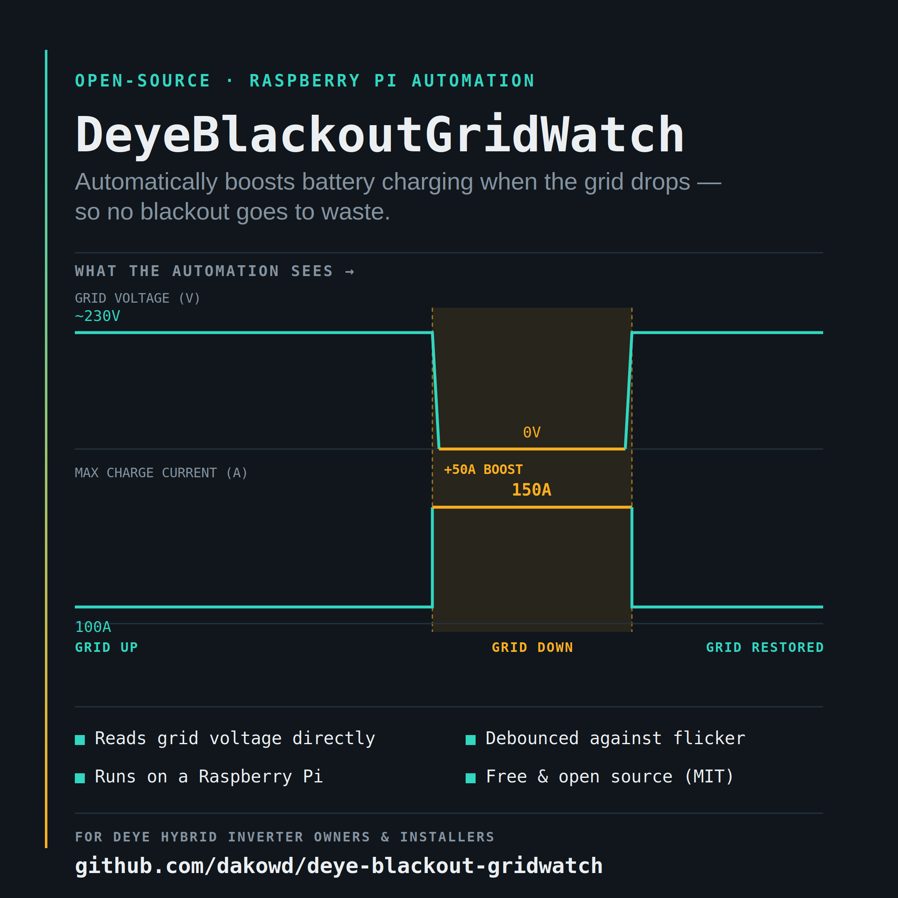

# DeyeBlackoutGridWatch



Automatically raise your Deye hybrid inverter's **Max Charge Current** during a grid outage, and lower it back once the grid returns — so you harvest solar as fast as possible when you can't export/sell anyway, while keeping normal gentle charging (and better battery longevity) when the grid is up.

> Built against the [DeyeCloud API v1](https://developer.deyecloud.com/api). Unofficial project — not affiliated with or endorsed by Deye / Ningbo Deye Inverter Technology Co., Ltd.

This is one of my Raspberry Pi homelab projects — built to control and monitor my solar setup remotely while away from home, without needing to be on-site to react to blackouts. It's built around and tested on my own Deye hybrid inverter and battery setup, and shared here free and open-source in case it helps other Deye owners or installers who currently handle this kind of grid-reactive charge management by hand. See [Disclaimer](#disclaimer) before configuring charge current values for your own system.

## Why

Grid-tied inverters can't export power during a blackout (anti-islanding), so if you normally throttle your charge current to leave room for grid export/net-metering, that throttling becomes pure lost opportunity the moment the grid drops. This project watches your inverter's live grid voltage via Deye's cloud API and automatically:

- **Grid up** → keeps Max Charge Current at your normal, conservative setting so excess solar goes to export/sale, and the battery is spared from being charged too aggressively.
- **Grid down** → raises Max Charge Current so you harvest as much solar into the battery as possible while the opportunity to export doesn't exist anyway.

> The `100A` / `150A` used throughout this README and in `.env.example` are **my own values** for my own setup (a 200Ah+ battery bank rated at 52V nominal) — not a universal recommendation. See [Sizing Max Charge Current for your own system](#sizing-max-charge-current-for-your-own-system) before you touch these.

## How it works

```
┌─────────────────────┐
│   Deye Inverter      │
└─────────┬───────────┘
          │ (via Deye's own cloud infrastructure)
┌─────────▼───────────┐
│   DeyeCloud API v1    │
│  (developer.deyecloud.com)
└─────────┬───────────┘
          │ HTTPS / REST
┌─────────▼───────────┐
│   controller.py       │  polls GridVoltageL1L2 every N seconds
│   (this project)      │  debounces state changes (avoids flapping)
│                        │  writes Max Charge Current only when needed
└──────────────────────┘
```

Grid status is detected directly from the inverter's own `GridVoltageL1L2` telemetry reading (via `/device/latest`) — no separate sensor needed. When voltage drops below a configurable threshold for several consecutive polls, the grid is considered down; when it's back above threshold for the same number of consecutive polls, it's considered up. Only on a *confirmed* state change does the controller check the currently-applied setting and write a new one if it actually differs.

## Requirements

- Python 3.9+
- A [DeyeCloud](https://www.deyecloud.com/login) account with your inverter/station already set up in the app
- A DeyeCloud developer application (AppId + AppSecret) from the [developer portal](https://developer.deyecloud.com/app), with **Station Monitoring**, **Device Monitoring**, and **Commission Control** access enabled

## Setup

```bash
git clone <your-repo-url>
cd deye-blackout-gridwatch

python3 -m venv .venv

# Linux / Raspberry Pi OS / macOS
source .venv/bin/activate
# Windows PowerShell
.\.venv\Scripts\Activate.ps1

pip install -r requirements.txt
cp .env.example .env   # then fill in your real credentials, see below
```

### Configuring `.env`

| Variable | Description |
|---|---|
| `DEYE_REGION` | `eu` (Europe/Africa/Asia-Pacific) or `us` (Americas) — determines the API base URL |
| `DEYE_APP_ID` / `DEYE_APP_SECRET` | From your app at developer.deyecloud.com/app |
| `DEYE_EMAIL` / `DEYE_PASSWORD` | Your normal DeyeCloud / Deye app login (plain text password — it's SHA-256 hashed locally before being sent) |
| `DEYE_COMPANY_ID` | Usually `0` |
| `DEYE_STATION_ID` | Your station's numeric ID — find it by running `test_read.py` once |
| `DEYE_DEVICE_SN` | Your inverter's serial number — also found via `test_read.py` |
| `GRID_DOWN_VOLTAGE_THRESHOLD` | Grid voltage (V) below which the grid is considered down |
| `NORMAL_MAX_CHARGE_CURRENT` | Max Charge Current (A) to apply when grid is up. **Do not copy my example value** — see [Sizing Max Charge Current for your own system](#sizing-max-charge-current-for-your-own-system) |
| `OUTAGE_MAX_CHARGE_CURRENT` | Max Charge Current (A) to apply when grid is down. **Do not copy my example value** — see [Sizing Max Charge Current for your own system](#sizing-max-charge-current-for-your-own-system) |
| `POLL_INTERVAL_SECONDS` | How often to poll the API |
| `DEBOUNCE_POLLS` | Consecutive consistent readings required before acting on a state change |
| `ACTIVE_START_TIME` / `ACTIVE_END_TIME` | Daily window (24h `HH:MM`, local time) during which the controller actually polls and acts. Outside this window it sleeps without calling the API — there's no solar to harvest at night, so Max Charge Current is moot either way. |
| `OUTSIDE_WINDOW_SLEEP_SECONDS` | How long to sleep between checks while outside the active window (no need to check every 30s overnight) |

**Never commit your `.env` file.** It's already in `.gitignore`.

### Sizing Max Charge Current for your own system

**The `100A` (normal) / `150A` (outage) values in this README and in `.env.example` are the settings I personally use — they come from my own battery bank (200Ah+, rated 52V nominal) and are only meant as a median, illustrative example. They are not a recommendation, and they are almost certainly wrong for your system.**

Before you set `NORMAL_MAX_CHARGE_CURRENT` or `OUTAGE_MAX_CHARGE_CURRENT` to anything, work out your own safe values from:

1. **Your battery/BMS's rated max charge current** — check the datasheet or ask your installer. Many lithium batteries express this as a C-rate (e.g. a 200Ah battery rated at 0.5C supports up to 100A of charge current). Smaller or older batteries, or different chemistries, can have very different limits.
2. **Your inverter's own maximum charge current spec** — this is a hard ceiling regardless of what your battery could theoretically accept. Check your Deye inverter model's datasheet.
3. **Whichever of the two is lower.** The safe setting is always the more conservative of "what my battery allows" and "what my inverter allows" — never just one of them.

Setting this too high for your actual hardware can degrade or damage your battery, void manufacturer/installer warranties, or create a real safety hazard (overheating, fire risk). If you're not confident you know your own battery and inverter's real limits, **don't guess** — ask your installer, consult your battery/BMS documentation, or reach out to Deye support before changing these values from whatever conservative default you start with.

## Usage

**1. Verify your credentials and discover your station/device IDs:**

```bash
python auth.py       # confirms login works
python test_read.py  # lists your stations, devices, current settings, and available telemetry keys
```

Copy the `stationId` and `deviceSn` it finds into `.env`.

**2. Run the automation:**

```bash
python controller.py       # Windows / general
python3 controller.py      # Linux / Raspberry Pi / macOS
```

It logs every poll, every debounced state change, and every write (or skipped write) with a timestamp. Stop it anytime with `Ctrl+C` — whatever setting was last applied stays applied.

### Running persistently on Raspberry Pi / Linux

For a foreground test, just run `python3 controller.py` directly in your terminal. For actual homelab use, you want it running in the background and surviving reboots — a few options, from quick-and-dirty to proper:

**Quick background run (survives you closing the SSH session, not a reboot):**

```bash
nohup python3 controller.py > controller.log 2>&1 &
# check on it later:
tail -f controller.log
```

**Or with `screen`/`tmux`** (lets you reattach and watch it live):

```bash
tmux new -s deyeblackoutgridwatch
# inside the tmux session:
source .venv/bin/activate
python3 controller.py
# detach with Ctrl+B then D -- it keeps running; reattach anytime with:
tmux attach -t deyeblackoutgridwatch
```

**Proper way: run it as a systemd service** (recommended for a Pi that's meant to just run this forever, including across reboots/power cycles). A ready-made unit file is included at `deploy/deyeblackoutgridwatch.service` — edit the paths inside it to match your setup, then:

```bash
sudo cp deploy/deyeblackoutgridwatch.service /etc/systemd/system/
sudo systemctl daemon-reload
sudo systemctl enable --now deyeblackoutgridwatch.service

# check status
sudo systemctl status deyeblackoutgridwatch.service

# follow logs live
journalctl -u deyeblackoutgridwatch.service -f
```

With this, the controller starts automatically on boot and restarts itself if it ever crashes — exactly what you want for something watching your power setup while you're away.

### Running on a NAS (Docker)

For NAS devices with Docker support (e.g. UGREEN DXP series running UGOS Pro, Synology, QNAP), a `Dockerfile` and `docker-compose.yml` are included. This also works identically on a Windows/Mac/Linux machine with Docker Desktop/Engine installed — Docker packages the app the same way regardless of the host OS, though a laptop that sleeps or shuts down isn't a realistic place to run this long-term; a NAS or Raspberry Pi that's always on is the real target.

**1. Get the project onto your NAS.** Easiest via SSH (enable it in your NAS's control panel first):

```bash
ssh your-user@your-nas-ip
git clone <your-repo-url>
cd deye-blackout-gridwatch
```

(No git on the NAS? Upload a zip of the repo through your NAS's File Manager/web UI instead, then extract it there.)

**2. Set up your config and persistent files:**

```bash
cp .env.example .env
nano .env             # fill in your real credentials and values
mkdir -p logs
touch .token_cache.json
```

**3. Edit `docker-compose.yml`** and set `TZ` to your actual timezone (e.g. `Asia/Manila`, `America/New_York`). This matters — `ACTIVE_START_TIME`/`ACTIVE_END_TIME` are compared against local time, and a container defaults to UTC if you don't set this.

**4. Build and run:**

```bash
docker compose up -d --build
```

**5. Check on it:**

```bash
docker compose logs -f
```

The container restarts automatically on failure or NAS reboot (`restart: unless-stopped`), and `logs/` + `.token_cache.json` are mounted from the NAS's own filesystem, so they survive container rebuilds.

If your NAS's Docker UI (e.g. UGOS Pro's Docker/Container Manager) supports importing a Compose project directly, you can point it at this same `docker-compose.yml` instead of using the CLI — the steps above (`.env`, `logs/`, `.token_cache.json`, correct `TZ`) still apply either way.

## Project structure

| File | Purpose |
|---|---|
| `auth.py` | Handles login (SHA-256 password hashing + `/account/token`), caches the token to disk, auto-refreshes on expiry |
| `client.py` | Thin wrapper around the confirmed DeyeCloud API v1 endpoints (read + write) |
| `controller.py` | The automation loop: polls grid voltage, debounces, writes Max Charge Current on confirmed state changes |
| `test_read.py` | One-off script to verify auth and explore your account's stations/devices/telemetry |
| `.env.example` | Template for required configuration — copy to `.env` and fill in |
| `deploy/deyeblackoutgridwatch.service` | systemd unit file for running the controller persistently on a Raspberry Pi / Linux box |
| `Dockerfile` / `docker-compose.yml` | For running on a NAS or any Docker host (see [Running on a NAS](#running-on-a-nas-docker)) |
| `.dockerignore` | Keeps secrets and local artifacts (`.env`, logs, token cache) out of the built image |

## Design notes / known limitations

- **Cloud-dependent.** Every read/write goes through Deye's cloud, not a local connection. If your home internet or Deye's servers are down, the automation can't act — worth knowing if you ever move to a local Modbus/RS485 setup instead.
- **Only runs during a configurable daylight window** (`ACTIVE_START_TIME`–`ACTIVE_END_TIME`, default 06:00–17:00). Outside it, the controller sleeps without polling — there's no solar to harvest at night, so adjusting Max Charge Current wouldn't do anything useful anyway. This is based on the system's local time, so make sure your Pi's timezone is set correctly (`timedatectl` on Linux).
- **Manual changes in the Deye app are respected until the next grid transition.** The controller doesn't continuously re-assert its target value — see the docstring in `controller.py` for details.
- **No enforced safety ceiling beyond what you configure.** `NORMAL_MAX_CHARGE_CURRENT` and `OUTAGE_MAX_CHARGE_CURRENT` are written to the inverter exactly as you set them — this project does not know your battery's or inverter's real limits and cannot check them for you. See [Sizing Max Charge Current for your own system](#sizing-max-charge-current-for-your-own-system).
- **The exact batch payload shape for a couple of secondary endpoints (e.g. business-account `/device/list`) wasn't needed/used here** — this project only relies on endpoints confirmed directly against the DeyeCloud API docs.

## Disclaimer

This project changes live settings on your inverter automatically, including battery charge current. It works for **my own** Deye hybrid inverter and battery setup — sharing it in case it helps other Deye owners or installers who currently do this kind of grid-reactive management manually.

**This is free, open-source software provided as-is, with no warranty of any kind.** You are solely responsible for:

- Understanding your own battery's and inverter's actual rated limits before configuring `NORMAL_MAX_CHARGE_CURRENT` / `OUTAGE_MAX_CHARGE_CURRENT` (see [Sizing Max Charge Current for your own system](#sizing-max-charge-current-for-your-own-system))
- Testing thoroughly with conservative values before relying on this for anything
- Any consequences of running this software on your own equipment, including but not limited to battery damage, equipment damage, voided warranties, or safety incidents

**Use at your own risk.** I am not liable for any damage, loss, or injury resulting from the use, misuse, or misconfiguration of this project. If you're not confident you understand what a setting does before changing it, don't change it — ask first.

## License

MIT — see [LICENSE](LICENSE).
